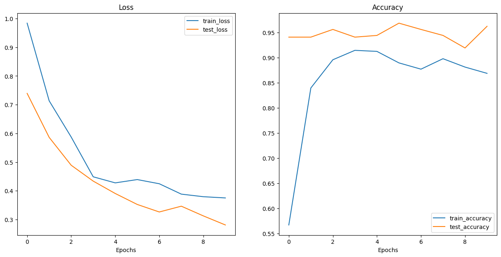
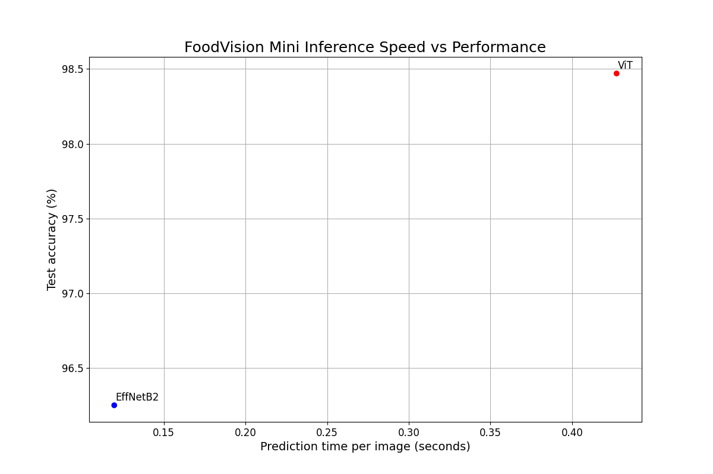
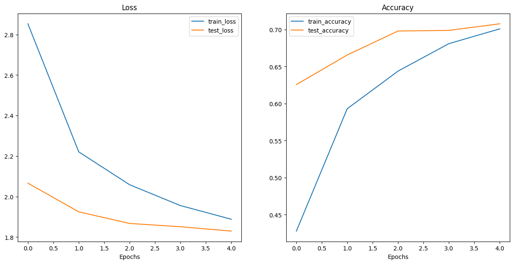

# Food Classification using Vision Transformers & EfficientNet


## Live Demo

Try the model in action! I have deployed the final Vision Transformer model to a Hugging Face Space.

[](https://huggingface.co/spaces/JankData/food-classification)

---

## Project Overview

This project focuses on building and evaluating Deep Learning models for fine-grained food image classification. The primary goal was to compare state-of-the-art architectures **EfficientNet** and **Vision Transformers (ViT)** using Transfer Learning, and ultimately scale the best-performing model to classify images into **101 different food categories**.

The project is based on the **[Food101 Dataset](https://docs.pytorch.org/vision/main/generated/torchvision.datasets.Food101.html)** provided by Torchvision.

### Key Features
* **Data Processing**: Custom subsets creation and dynamic data augmentation using `TrivialAugmentWide`.
* **Model Comparison**: Side-by-side evaluation of `EfficientNet_B2` and `ViT_B_16`.
* **Performance Metrics**: Analysis of accuracy, loss, parameter count, and inference time.
* **Deployment**: A fully functional Gradio application deployed to the cloud.

---

## Methodology

### 1. The "Mini" Experiments
To iterate quickly and compare architectures, I initially created a subset of the dataset containing only three classes: **Pizza, Steak, and Sushi** (using 20% of the training data).

* **EfficientNet_B2**: Selected for its balance between accuracy and computational efficiency.
    * *Weights*: Pre-trained on ImageNet.
    * *Classifier*: Modified to output 3 classes.
* **Vision Transformer (ViT-B/16)**: Selected to test the capabilities of transformer-based architectures in vision tasks.
    * *Weights*: Pre-trained on ImageNet.
    * *Heads*: Modified to output 3 classes.

### 2. Scaling Up
After analyzing the results from the mini-experiments, the **ViT** model was selected to be trained on the full **Food101 dataset**.
* **Training Split**: To manage compute resources in the Colab environment, a random 20% split of the official training set was used for training, while maintaining a robust test set.
* **Epochs**: The full model was trained for 5 epochs.

## Results & Analysis

### Phase 1: EfficientNet vs. ViT

Both models were trained for 10 epochs on the 3-class subset.

| Model | Test Loss | Test Accuracy | Parameters | Inference Time (CPU) |
| :--- | :--- | :--- | :--- | :--- |
| **EfficientNet_B2** | 0.2811 | 96.25% | ~7.7M | ~0.1197s |
| **ViT_B_16** | 0.0644 | **98.47%** | ~85.8M | ~0.4272s |

#### Training Curves
Below are the loss and accuracy curves for both models during the 3-class experiment.

<p align="center">
  
  
</p>

**Observation:** The Vision Transformer converged significantly faster and achieved a lower loss compared to EfficientNet, reaching near-perfect accuracy on this small subset.

#### Speed vs. Performance Trade-off
I conducted a benchmark to visualize the trade-off between the model speed and its accuracy.



**Conclusion:**
* **ViT** provides superior accuracy but is heavier and slower.
* **EfficientNet** is highly efficient and lightweight, though slightly less accurate in this specific test.

---

### Phase 2: Full Scale Training

Using the **Vision Transformer**, I scaled the problem to classify all 101 food categories. Despite using only 20% of the training data and running for just 5 epochs, the model showed promising results.



* **Final Test Accuracy**: ~70.8%
* **Context**: The model shows a steady decrease in loss and increase in accuracy, suggesting that with more training time and the full 100% dataset, performance would likely exceed 85-90%.

## Deployment

 The trained ViT model (`pretrained_vit_feature_extractor_food101_20_percent.pth`) has been deployed using **Gradio**.

### App Structure
The application loads the class names and the trained model state dictionary. It accepts an image input, applies the necessary Torchvision transforms, and outputs the top 5 predicted food classes along with the inference time.

**Key capabilities:**
* Accepts uploaded images via UI.
* Shows prediction confidence probabilities.
* Displays inference speed.

You can view the full source code for the app in the `app.py` file in this repository.

---

## How to Run

### Prerequisites
* Python 3.8+
* PyTorch
* Torchvision
* Gradio

### Installation

1.  Clone the repository:
    ```bash
    git clone [https://github.com/JankData/food-classification.git](https://github.com/JankData/food-classification.git)
    cd food-classification
    ```

2.  Install dependencies:
    ```bash
    pip install -r requirements.txt
    ```

3.  Run the Gradio App locally:
    ```bash
    python app.py
    ```
